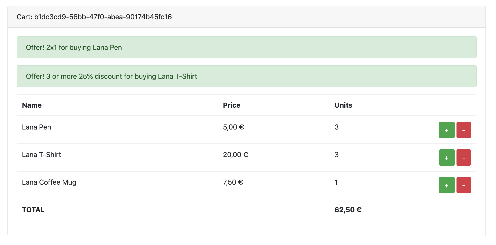

# checkout-frontend

After run the app using:
```bash
docker-compose up
```
You can access to `http://localhost:8000/checkout/`

By default, when you enter the checkout page a new cart is created (and its cart_id will be aggregated to the URL). The next actions will work over this cart_id.

Really, the checkout-frontend isn't the objective of this challenge. The frontend is just to have a client implementation to see how to interact with the server system.

