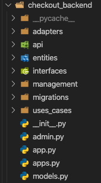
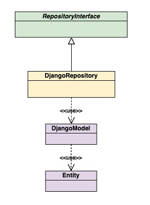
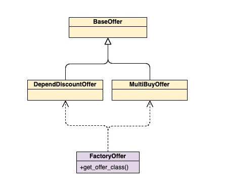

# how-was-developed

## Clean architecture

I implemented my own vision of a clean architecture creating: Interfaces, Adapters, Entities and Uses cases.

- Interfaces: Definition of what method have to have each repository implemented.

- Adapters: They implement `Interfaces` using the ORM decided. In this case, Django. Also, they always return the `Entity` of the model, not the `DjangoModel`.

- Entities: Simple object that represents each model.

- Uses cases: Will implement its logic using `Adapters`

## Repository pattern

In the `interfaces` folder are declared the interfaces to be implemented by any repository type. In this case, Django Repositories were implemented.

The Django Repositories interact with Django Models but **always** return its Entity. 

An example: `DjangoProductRepository` implements `ProductRepository` and it uses `Product Django Model` but all `Django Models` have `to_entity()` method to return its Entity.

## Offer hierarchy

Offers have common behavior in `BaseOffer` and there are 2 offer subtypes: `MultiBuyOffer` and `DependDiscountOffer`. Each one overrides the `get_subtotal_amount` method to adapt its logic.

On the other hand, in order to create the proper offer, there is a `FactoryOffer` which return the instance of the correct offer

## Total amount processor

In order to integrate `Offers` in the total amount calculation I decided to create this class to process all items in the cart taking into account of the existing offers.